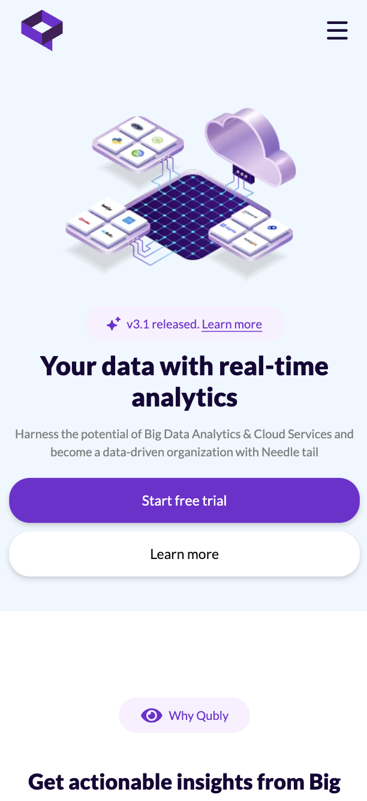
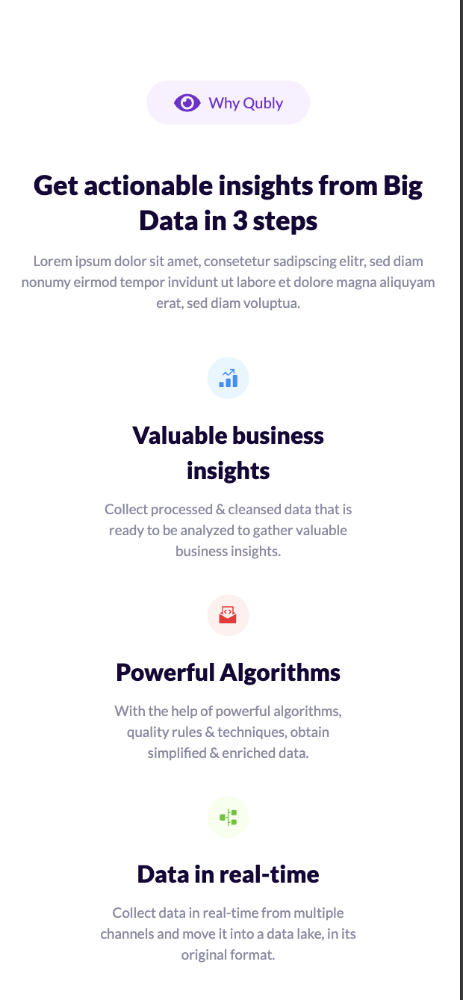
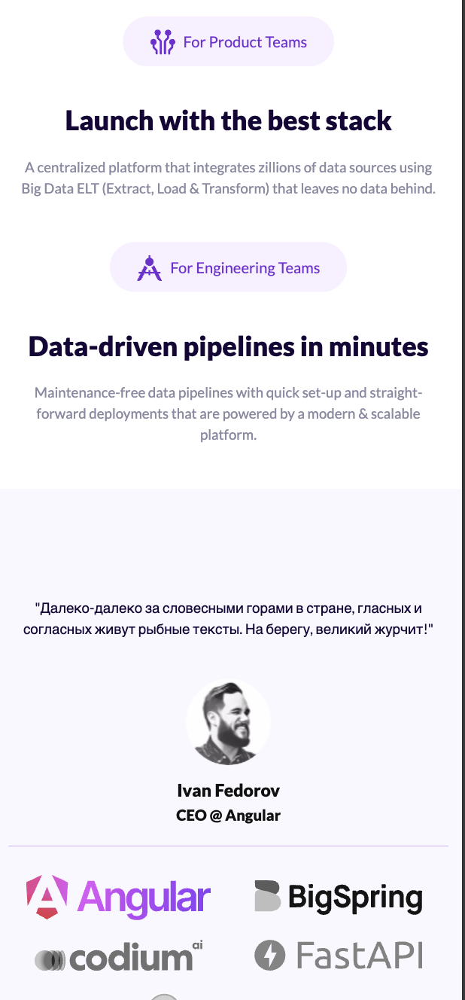
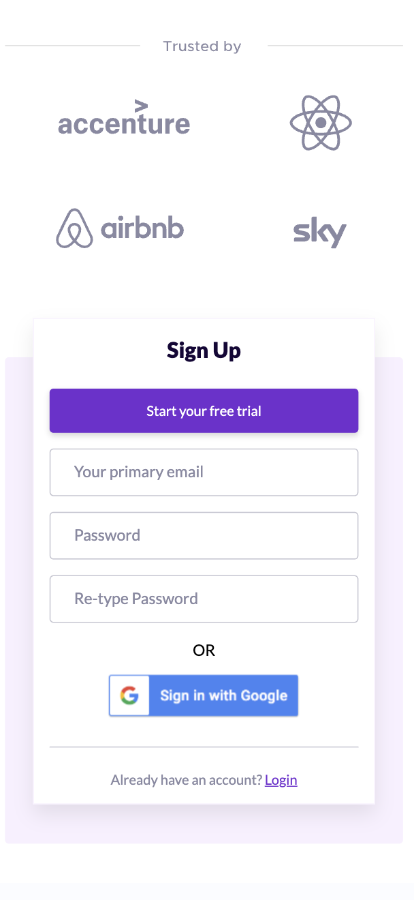

## 🧩 Qubly – Landing Page (Legacy UI/Markup)

Status: Legacy project from an older portfolio.
Focuses on pixel-perfect UI layout and responsive markup.
No backend, no frameworks — just clean HTML, CSS, and minimal JS.

<p align="center">
  <a href="https://luxenonbeterris.github.io/qubly-landing/">
    
  </a>
</p>


---

## 🔗 Quick Links
- **Live Demo:** https://luxenonbeterris.github.io/qubly-landing/
- **Tech:** [HTML5](https://developer.mozilla.org/docs/Web/HTML) · [CSS3](https://developer.mozilla.org/docs/Web/CSS) · [jQuery](https://jquery.com/) · [Fancybox](https://fancyapps.com/fancybox/) · [Bootstrap Grid](https://getbootstrap.com/docs/5.3/layout/grid/) · [Animate.css](https://animate.style/) · [WOW.js](https://github.com/matthieua/WOW)
---

## ✨ Highlights
	-	🎯 Pixel-perfect UI — clean sections: hero, advantages, info, reviews, CTA.
	-	📱 Responsive — mobile-first layout (adaptive.css).
	-	🧭 Smooth navigation — anchor scrolling + hamburger menu.
	-	🖼 Lightweight UI libs — Animate.css, WOW.js, Fancybox.
	-	⚡ Zero build step — just open index.html or run a tiny HTTP server.

---

## 🛠️ Technology Stack
```text
| Layer   | Tools                                             |
|---------|---------------------------------------------------|
| Markup  | HTML5, semantic structure                         |
| Styles  | CSS3 (`main.css`, `adaptive.css`), Bootstrap Grid |
| Scripts | jQuery, Fancybox, WOW.js, Animate.css             |
| Assets  | SVG/PNG icons in `/img/`                          |
```

---

## 🚀 Getting Started

Option A — One-liner (Python)

# from the project root (where index.html lives)
python3 -m http.server 5173

Open → http://localhost:5173

Option B — Node static server (optional)

npx http-server -p 5173 .

Or simply open index.html directly, but a local server is recommended for consistent paths.

---

## 📸 Screenshots

<div align="center">
  
  
  
  
</div>


---

## 📂 Project Structure

``` text
Qubly/
├── index.html
├── css/
│   ├── main.css
│   └── adaptive.css
├── js/
│   └── common.js
├── libs/
│   ├── bootstrap-grid.min.css
│   ├── animate.css
│   ├── jquery.fancybox.min.{css,js}
│   └── jquery/dist/jquery.min.js
└── img/
    ├── favicon/
    ├── main_banner/
    ├── advantages/
    ├── info_1/ info_2/
    └── reviews/ footer/ etc.
```

---

## 🔧 Development Notes
	-	No framework/bundler — edit HTML/CSS/JS directly.
	-	Animations powered by Animate.css + WOW.js.
	-	Smooth scrolling and mobile menu handled via jQuery.

---

## 📜 License

GNU Affero General Public License v3 (AGPLv3)

---

## 🗒️ Context (for Recruiters/HR)

This is one of my older projects focused on markup and responsive UI skills.
I intentionally avoided frameworks and heavy tooling here to demonstrate clean HTML/CSS structure and minimal JS enhancements.